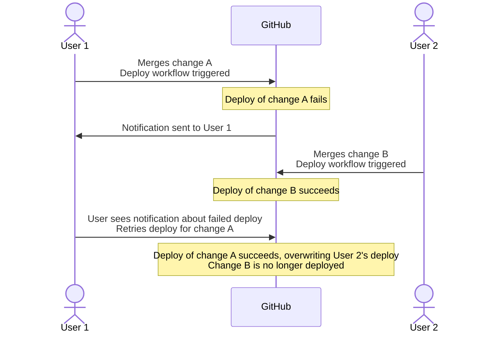

# Block Old Workflow Re-run

Makes sure an older workflow run isn't allowed to be re-run,
in case a newer workflow run already is running or has completed.

This helps avoid situations where GitHub Actions may be used to deploy some code,
where a person may end up inadvertently deploying an older version of the code:



GitHub Actions does unfortunately not have built-in functionality to avoid situations like this.

This action tries to fill that gap by calling GitHub's API
and checking if there's a newer workflow run that either is in progress or has finished running,
and if found, will cause the (outdated) workflow run to be stopped.


## Inputs

### `token`

**Required** Token used to contact the GitHub API.
Defaults to `github.token`.
Read access to the repository is required.

### `branch`

Limit checking to only happen for the provided branch.
This can be used if the same workflow may run for multiple branches,
but deploys e.g. only are triggered when run on the `main` branch.

### `fail-on-old-rerun`

Fail the workflow run in case an old workflow is being rerun.
Defaults to `true`.
If set to `false`, use the `allowed` output.


## Outputs

### `allowed`

Boolean value to say if the run should be allowed (`true`) or not (`false`).


## Example

```yaml
steps:
  - name: Check this is the newest workflow run
    uses: Tenzer/block-old-workflow-rerun@v1
  
  - name: Deploy code
    # ...
```
